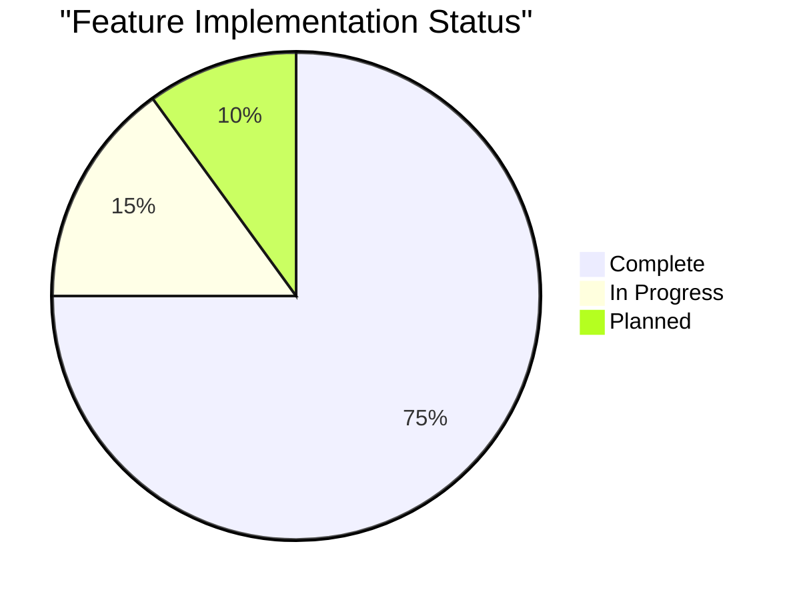

# Progress: Joy-Con ESP32 Interface

## Project Status Overview

### Implementation Progress

## Completed Features

### 1. Core Connectivity
- [x] Bluetooth initialization
- [x] Controller discovery
- [x] Connection management
- [x] Disconnection handling
- [x] Multiple controller support

### 2. Button Handling
- [x] Standard button mapping (A, B, X, Y)
- [x] D-pad implementation
- [x] Special buttons (SL, SR, R, ZR)
- [x] System buttons (Home, Plus)
- [x] Thumbstick button
- [x] Button state tracking
- [x] Press/release detection

### 3. Analog Input
- [x] Basic calibration
- [x] Deadzone implementation
- [x] Direction detection
- [x] Diagonal movement
- [x] Movement intensity calculation

### 4. System Features
- [x] Serial debugging
- [x] Basic error handling
- [x] Watchdog compliance
- [x] Memory management

## In Progress

### 1. Testing Framework (15%)
- [ ] Unit test implementation
- [ ] Integration tests
- [ ] Performance benchmarks
- [ ] Stress testing

### 2. Documentation (40%)
- [x] Basic API documentation
- [ ] Integration guides
- [ ] Calibration procedures
- [ ] Troubleshooting guide

### 3. Optimization (30%)
- [ ] Input latency reduction
- [ ] Memory usage optimization
- [ ] Processing efficiency
- [x] Basic timing optimization

## Planned Features

### 1. Enhanced Calibration
- [ ] Per-controller calibration
- [ ] Dynamic calibration updates
- [ ] Calibration persistence
- [ ] Calibration UI/interface

### 2. Advanced Features
- [ ] Custom button mapping
- [ ] Configuration profiles
- [ ] Extended debug modes
- [ ] Performance metrics

### 3. Quality of Life
- [ ] Auto-reconnection
- [ ] Battery monitoring
- [ ] Status indicators
- [ ] Error recovery

## Known Issues

### 1. Hardware Limitations
- Fixed calibration values need manual adjustment
- Bluetooth range limitations
- Platform-specific constraints

### 2. Software Constraints
- Fixed 150ms update rate
- Basic error handling only
- Limited configuration options

## Testing Status

### 1. Completed Tests
- Basic connectivity
- Button input verification
- Analog stick movement
- Multiple controller handling

### 2. Pending Tests
- Long-term stability
- Power consumption
- Input latency
- Error recovery
- Multi-controller stress test

## Performance Metrics

### 1. Current Measurements
- Update Rate: 150ms
- Connection Time: ~2-3 seconds
- Input Latency: To be measured
- Memory Usage: To be measured

### 2. Target Metrics
- Update Rate: 50ms or less
- Connection Time: Under 2 seconds
- Input Latency: Under 16ms
- Stable long-term operation

## Development Roadmap

### Phase 1: Core Implementation ✓
- [x] Basic connectivity
- [x] Input processing
- [x] Debug output
- [x] Error handling

### Phase 2: Enhancement (Current)
- [ ] Testing framework
- [ ] Performance optimization
- [ ] Documentation
- [ ] Quality assurance

### Phase 3: Advanced Features
- [ ] Enhanced calibration
- [ ] Configuration system
- [ ] Extended debugging
- [ ] Performance monitoring

### Phase 4: Polishing
- [ ] User experience
- [ ] Error recovery
- [ ] Power optimization
- [ ] Final documentation

## Resource Utilization

### Current Usage
- Program Memory: To be measured
- RAM Usage: To be measured
- Processing Time: Variable

### Optimization Targets
- Reduce memory footprint
- Optimize processing loops
- Improve timing efficiency
- Enhance stability

## Documentation Progress

### Completed
- [x] Basic API documentation
- [x] Setup instructions
- [x] Core functionality
- [x] Initial memory bank

### In Progress
- [ ] Integration guides
- [ ] Testing procedures
- [ ] Calibration guide
- [ ] Troubleshooting

### Planned
- [ ] Advanced features
- [ ] Performance tuning
- [ ] Configuration guide
- [ ] Example projects
