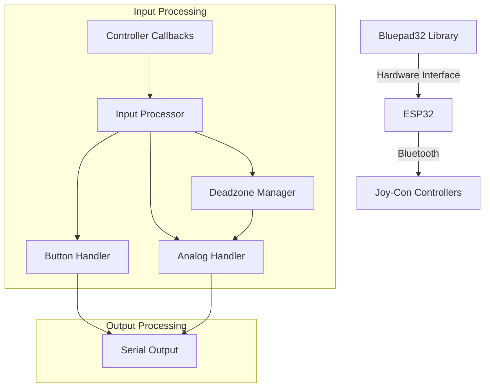
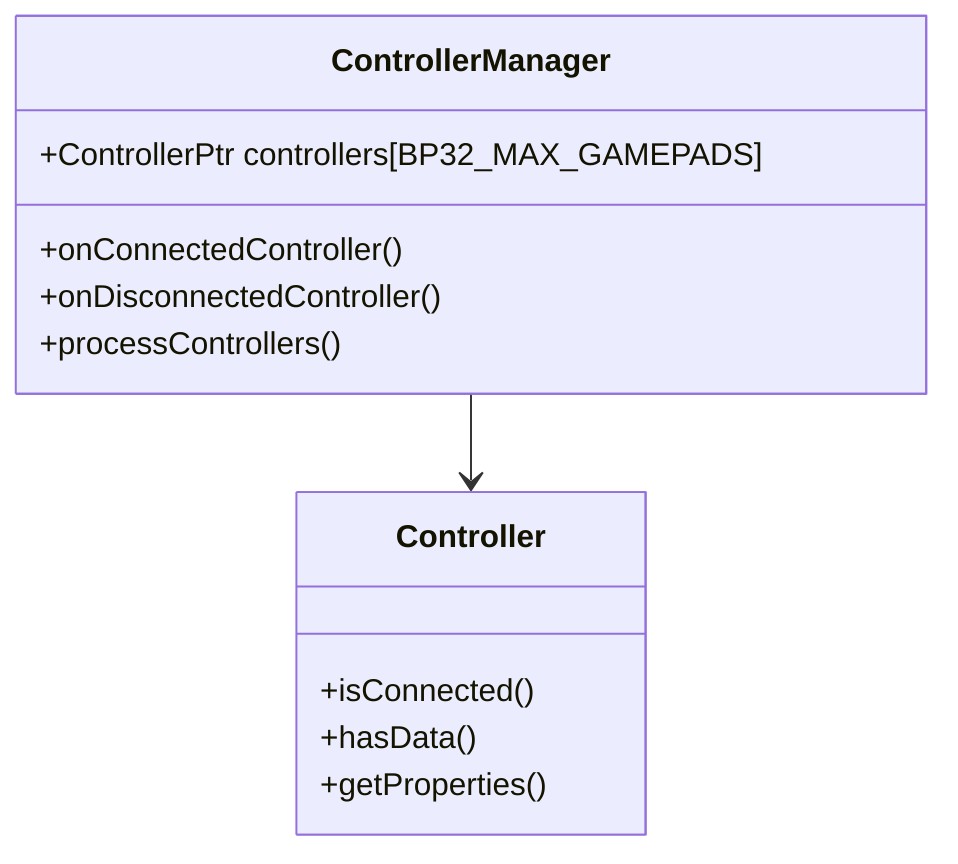
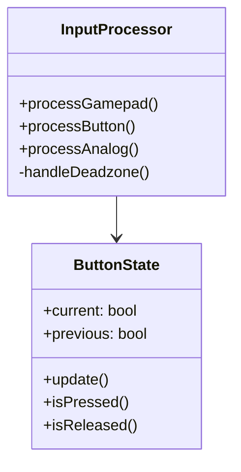
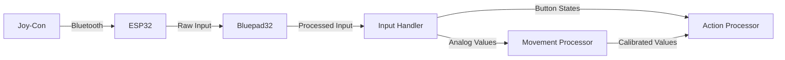

# System Patterns: Joy-Con ESP32 Interface

## Architecture Overview



## Core Components

### 1. Controller Management


### 2. Input Processing


## Design Patterns

1. **Observer Pattern**
   - Used for controller connection/disconnection events
   - Callback-based event handling
   ```cpp
   BP32.setup(&onConnectedController, &onDisconnectedController);
   ```

2. **State Pattern**
   - Button state tracking
   - Previous/current state comparison
   ```cpp
   static bool prevButton = false;
   bool currentButton = (ctl->buttons() & BUTTON_MASK);
   ```

3. **Factory Pattern**
   - Controller instance creation
   - Automatic type detection and initialization

4. **Command Pattern**
   - Button action handling
   - Input to action mapping

## Core Systems

### 1. Connection Management
- Dynamic controller array
- Auto-discovery of controllers
- Connection state tracking
- Automatic slot management

### 2. Input Processing System
- Button state tracking
- Analog input calibration
- Movement detection
- Intensity calculation

### 3. Calibration System
- Idle position tracking
- Deadzone management
- Range calibration
- Drift compensation

## Data Flow



## Key Technical Decisions

1. **Bluetooth Management**
   - Use of Bluepad32 for reliable connection
   - Automatic key forgetting on startup
   - Virtual device support disabled

2. **Input Processing**
   - State-based button handling
   - Calibrated analog processing
   - Deadzone implementation
   - Diagonal movement detection

3. **Performance Optimization**
   - 150ms delay in main loop
   - Watchdog compliance
   - Efficient state tracking

## Error Handling

1. **Connection Errors**
   - Slot availability checking
   - Disconnection handling
   - Reconnection support

2. **Input Validation**
   - Range checking
   - Deadzone filtering
   - Calibration compensation

3. **System Stability**
   - Watchdog timer management
   - Memory management
   - Error logging

## System Constants

```cpp
// Core Constants
const int DEADZONE_THRESHOLD = 25;

// Analog Thresholds
const int JOYCON_LEFT_THRESHOLD = -200;
const int JOYCON_RIGHT_THRESHOLD = 150;
const int JOYCON_UP_THRESHOLD = -200;
const int JOYCON_DOWN_THRESHOLD = 200;

// Calibration Values
const int JOYCON_IDLE_X = -55;
const int JOYCON_IDLE_Y = 13;
```

## Integration Points

1. **Hardware Integration**
   - ESP32 Bluetooth stack
   - Serial communication
   - Controller hardware

2. **Software Integration**
   - Bluepad32 library
   - Arduino framework
   - Custom application code

## System Boundaries

1. **Input Boundaries**
   - Controller connection/disconnection
   - Button presses/releases
   - Analog stick movement

2. **Output Boundaries**
   - Serial debugging output
   - Action triggers
   - State updates

3. **System Constraints**
   - Processing speed
   - Memory usage
   - Bluetooth limitations
